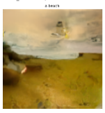
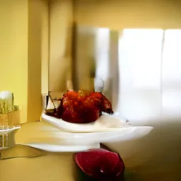
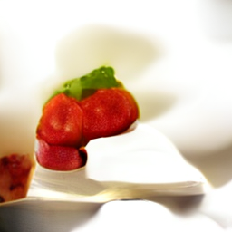
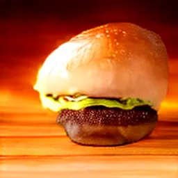
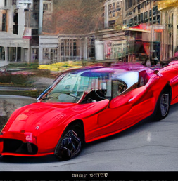
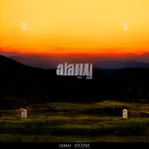

# ZYI Evolution

  <b>Visual progress of the ZYI text-to-image model family</b> 
  From ZYI 0.2 to ZYI 1.4

---

## About

ZYI is an experimental family of small text-to-image models focused on improving image quality, prompt following and composition with limited compute.

This repository shows the visual evolution of the project across multiple versions.

---

# Model Timeline

## ZYI 0.2

Early experimental version.

- Very limited image quality
- Weak object structure
- Early concept learning
- Small training setup

---

## ZYI 1.0

First major usable version.

Main improvements:

- Better object recognition
- Improved colors
- More coherent scenes
- Stronger text conditioning

---

## ZYI 1.1

Continued training from ZYI 1.0.

Main improvements:

- Better composition
- Smoother images
- More stable backgrounds
- Improved prompt understanding

---

## ZYI 1.2

Further refinement of the ZYI Tiny family.

Main improvements:

- Better object structure
- Cleaner scenes
- Improved realism
- Stronger text alignment

---

## ZYI 1.3 ReasonFast

A dataset-focused improvement.

Training focused more on:

- Composition
- Multiple objects
- Spatial relationships
- Entity understanding
- Style diversity
- Better prompt following

---

## ZYI 1.4 ReasonFast

Continued fine-tuning from ZYI 1.3.

Main goals:

- Improved object geometry
- Better realism
- Stronger composition
- Better consistency across seeds
- Further refinement of prompt following

---

# Visual Comparison

| ZYI 0.2 | ZYI 1.0 | ZYI 1.1 |
|---|---|---|
|  |  |  |

| ZYI 1.2 | ZYI 1.3 | ZYI 1.4 |
|---|---|---|
|  |  |  |

---

# Same Prompt, Same Seed

For a fair visual comparison, the same prompts and seeds can be used across versions.

Example prompts:

- `a yellow school bus parked on a dirt road in a forest`
- `a red sports car on a city street`
- `a bowl of strawberries on a white kitchen table, natural light`
- `a castle on a green hill under a cloudy sky`

Example seed:

`42`

---

# Progress

ZYI 0.2  
↓  
ZYI 1.0  
↓  
ZYI 1.1  
↓  
ZYI 1.2  
↓  
ZYI 1.3 ReasonFast  
↓  
ZYI 1.4 ReasonFast

---

# Goal

The goal of ZYI is not to build the largest image model.

The goal is to explore:

> How good can a small text-to-image model become through better data, better training and continued iteration?

---

# Repository Structure

ZYI-Evolution/  
├── README.md  
└── images/  
&nbsp;&nbsp;&nbsp;&nbsp;├── zyi-0.2.png  
&nbsp;&nbsp;&nbsp;&nbsp;├── zyi-1.0.png  
&nbsp;&nbsp;&nbsp;&nbsp;├── zyi-1.1.png  
&nbsp;&nbsp;&nbsp;&nbsp;├── zyi-1.2.png  
&nbsp;&nbsp;&nbsp;&nbsp;├── zyi-1.3.png  
&nbsp;&nbsp;&nbsp;&nbsp;└── zyi-1.4.png  

---

# Future

Possible future versions:

- ZYI 1.5
- Larger and more diverse datasets
- Improved text rendering
- Stronger spatial reasoning
- Improved anatomy
- Higher resolution
- Faster sampling
